# AWS EC2 Snapshot Creation Guide

This guide provides step-by-step instructions for creating snapshots of your Amazon EC2 instances and EBS volumes.

## Table of Contents
1. [What is an AWS Snapshot?](#what-is-an-aws-snapshot)
2. [Prerequisites](#prerequisites)
3. [Creating an EBS Snapshot](#creating-an-ebs-snapshot)
4. [Creating an AMI (Instance Snapshot)](#creating-an-ami-instance-snapshot)
5. [Additional Resources](#additional-resources)

## What is an AWS Snapshot?
An AWS snapshot is a point-in-time copy of your Amazon Elastic Block Store (EBS) volume or entire EC2 instance (as an AMI). Snapshots are used for:
- Backing up your data
- Creating templates for new instances
- Migrating data between regions

## Prerequisites
- An AWS account with appropriate permissions
- An existing EC2 instance or EBS volume
- AWS Management Console access

## Creating an EBS Snapshot

### Step 1: Log in to AWS Console
1. Go to [AWS Management Console](https://aws.amazon.com/console/)
2. Sign in with your credentials
   
   

### Step 2: Navigate to EC2 Dashboard
1. From the AWS Services menu, select "EC2" under "Compute"

2. ec2 dash board.
   
   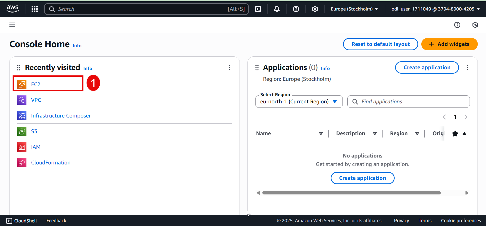

3.select "instance".

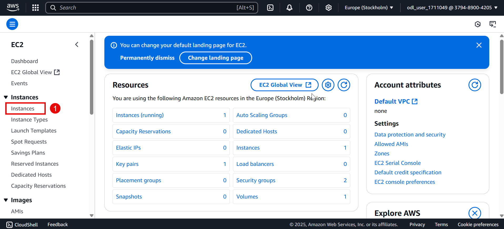

### Step 3: Locate Your EBS Volume
1. In the EC2 Dashboard, find the "Elastic Block Store" section in the left sidebar

2.select the "storage" option.

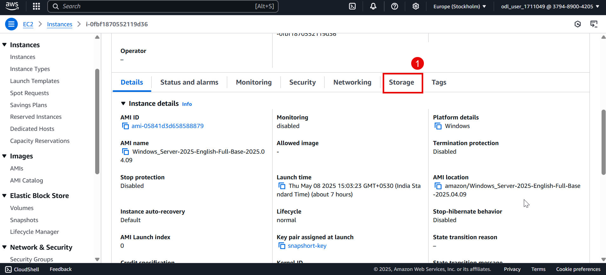

3. Click on "Volumes"
   
   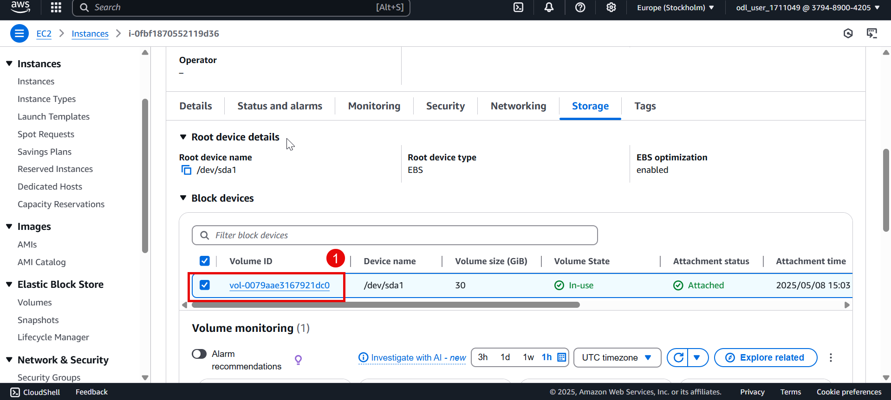
   
4. Identify the volume you want to snapshot from the list

### Step 4: Create the Snapshot
1. Select the volume by checking its checkbox

2. Click the "Actions" button
   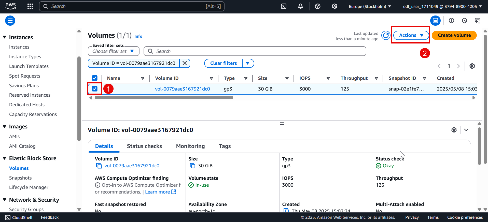
   
 
3. Select "Create snapshot" from the dropdown menu
 
 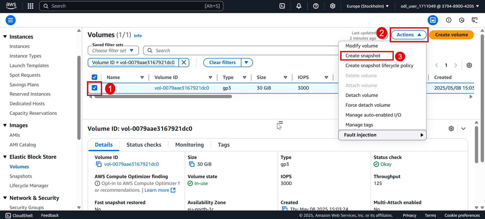
 
4. In the "Create snapshot" dialog:
   
   - Enter a descriptive name for the snapshot
     
  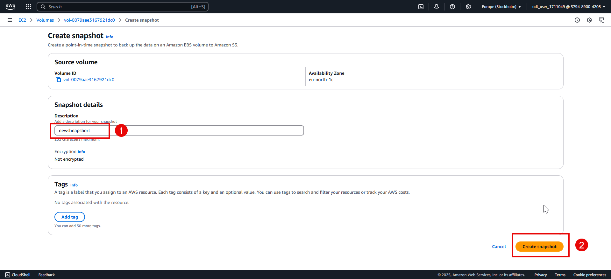
     
   - Add tags if needed (recommended for organization)

     
5. Click "Create snapshot"

### Step 5: Verify Snapshot Creation
1. In the left sidebar, click "Snapshots" under "Elastic Block Store"
   
2. Your new snapshot will appear in the list (it may take a few moments)
3. The status will change from "pending" to "completed" when ready
   
   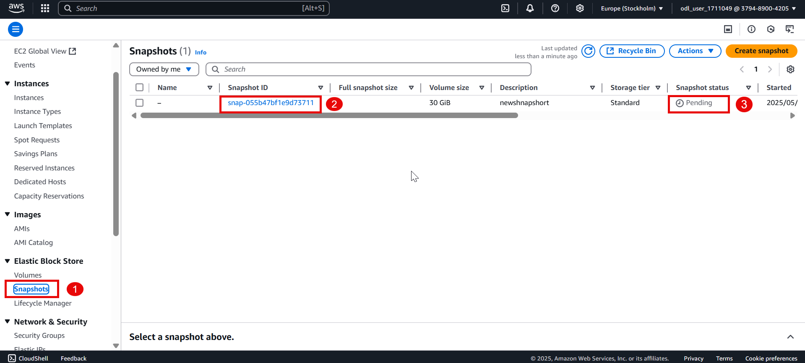

4.creation completed status.
   
   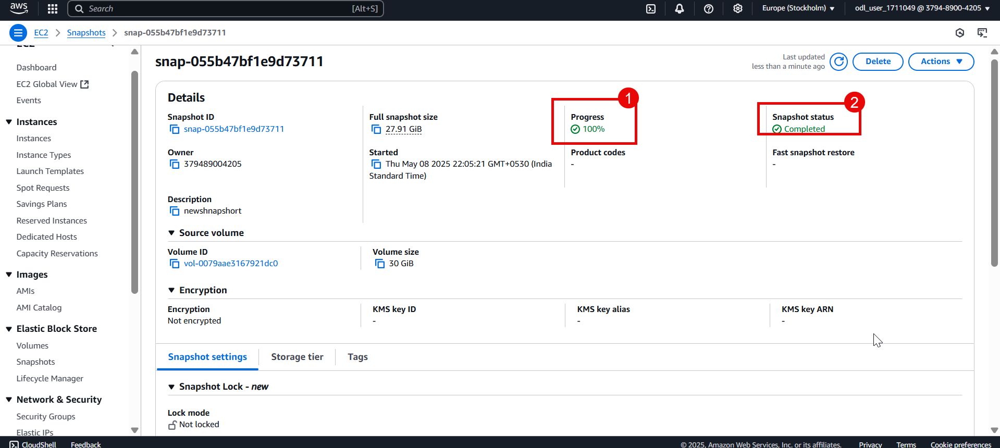

## Creating an AMI (Instance Snapshot)

### Step 1: Navigate to Instances
1. In the EC2 Dashboard, click "Instances" in the left sidebar
2. 
   

### Step 2: Select Your Instance
1. Check the box next to the instance you want to snapshot
2. 
   
   

### Step 3: Create Image
1. Click "Actions" button
2. 
   
   
3. Navigate to "Image and templates" > "Create image"
 
   
   
4. In the "Create image" dialog:
   - Enter an image name
   - Add description (optional but recommended)

     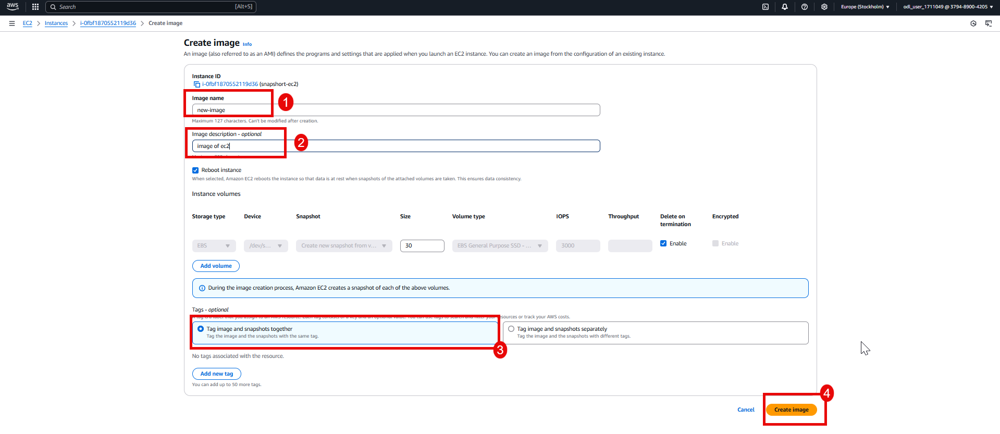
     
   - Configure other options as needed
     

5. Click "Create image"
 

### Step 4: Check AMI Status
1. In the left sidebar, click "AMIs" under "Images"
   
   
   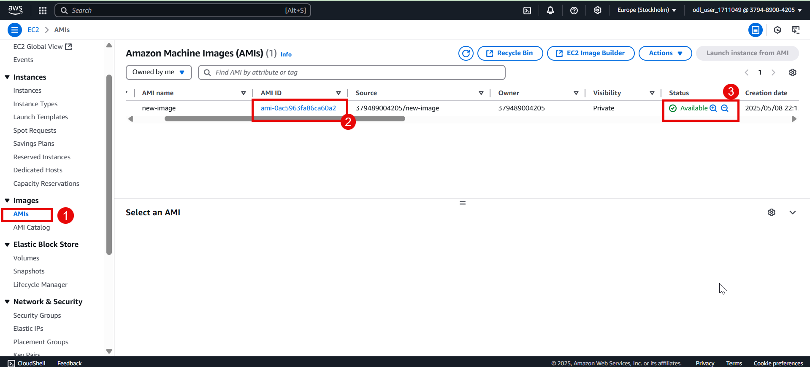
   
2. Your new AMI will appear with status "pending"
 
   
3. Wait for status to change to "available" before use
 
   

## Additional Resources
- [AWS EBS Snapshot Documentation](https://docs.aws.amazon.com/AWSEC2/latest/UserGuide/EBSSnapshots.html)
- [AWS AMI Documentation](https://docs.aws.amazon.com/AWSEC2/latest/UserGuide/AMIs.html)
- [AWS Backup Service](https://aws.amazon.com/backup/)
